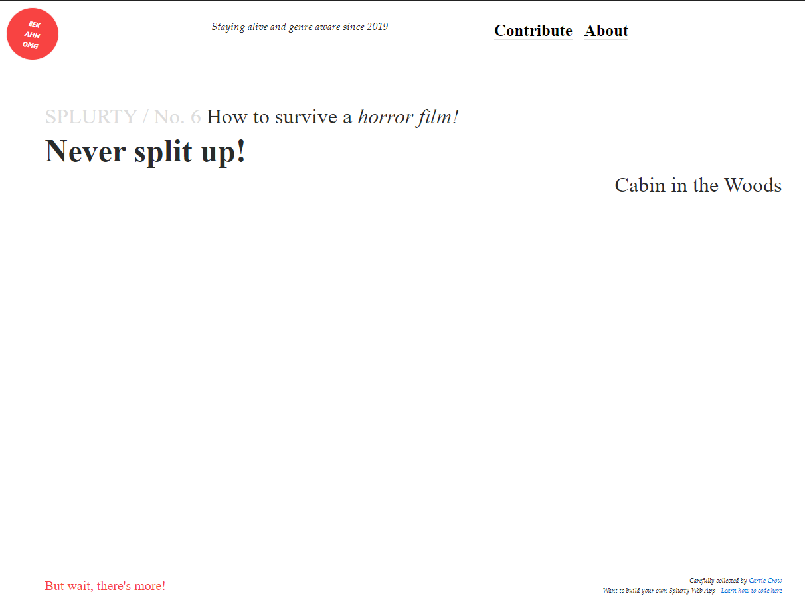
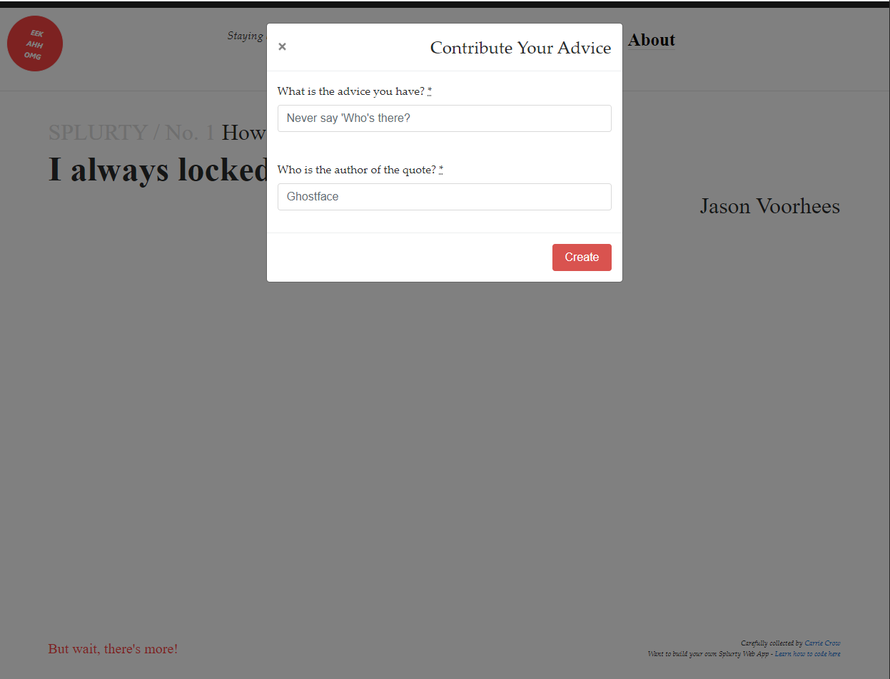

# Splurty

Splurty allows users to submit quotes to a database of advice, and randomly view an uploaded quote.

This application was created as part of the University of Wisconsin Extension Bootcamp.

## User Stories

As user, I want to:
  * See a random quote on the index page so that I can learn
  * Refresh the page so that I can see a new quote
  * Add a quote so that I can share my thoughts

## How to run the application:

### Production
Navigate to the production location of [Splurty](https://splurty-carrie-crow.herokuapp.com/)
1. From the home page, you are shown one quote:

2. To view another, click "But wait, there's more!" You will be shown a random quote from the database.
3. To add a quote, click "Contribute" and fill out the firm presented:

## High Level Organization
Splurty uses SimpleForm gem to save entered quotes to a PostGreSQL database. The quotes controller determines a value at random to present on the initial home page.

### Application Specs
Nomster is a Ruby on Rails application, with a database is managed by Postgres
* Rails v. 5.2.3
* Ruby v. 2.5.3

### Integrations Used

The following gems support Flixter's functionality:
* Simple Form gem, for managing user input
* Bootstrap, for page layout